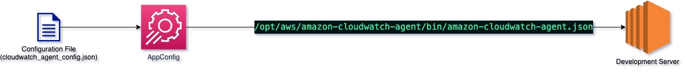

## Objective
Uploads Cloudwatch Logs Configuration file into AppConfig, so that developers can easily revise changes to the file anytime, via AWS console.



## Prerequisites
| Requirement | Description |
| ----------- | ----------- |
| Terraform | [Installation Instructions](https://learn.hashicorp.com/tutorials/terraform/install-cli) |
| AWS Account and CLI Credentials | [Create Account](https://console.aws.amazon.com/console/home) |
| Terraform Backend | [Setting up backend](https://www.terraform.io/language/settings/backends/s3)

## Installation

1. Update `setup/state.tf` file with an AWS cli profile with admin access, Terraform backend state and lock file using pre-configured S3 bucket and DynamoDB table.
2. Deploy using Terraform and AWS provider
```
cd setup
terraform plan -out infra-plan.json
terraform apply 
```
